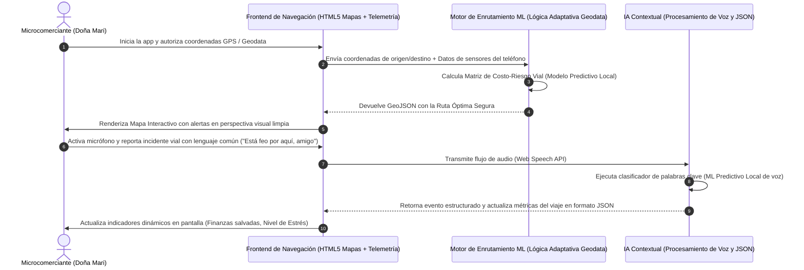

# PACKET: Sistema de Rutas Confiables y Logística Inversa para Microcomerciantes (Semana 7)

## 1. El Problema en Mis Propias Palabras
Los microcomerciantes informales que abastecen sus puestos (como Doña Mari transportando insumos desde centrales de abasto) se enfrentan a una pérdida drástica de rentabilidad y seguridad debido a la falta de optimización geográfica. Al no tener acceso a herramientas de geolocalización adaptadas a su realidad, sufren de rutas ineficientes que elevan el costo de transporte, zonas de alta criminalidad no mapeadas que ponen en riesgo su integridad física, y una nula planeación de logística inversa (compartir fletes o vehículos de regreso para amortizar gastos). Las herramientas comerciales ignoran el sesgo operativo del sector informal y no asimilan los datos de telemetría o voz en entornos de alta fricción tecnológica.

## 2. Definición de Éxito Exacto del Usuario
*   **Entrada:** El usuario proporciona su ubicación actual de origen, el destino de abastecimiento e ingresa mediante comandos de voz simples o telemetría del teléfono un reporte de incidentes en la vía.
*   **Procesamiento:** El sistema procesa las coordenadas de mapas mediante algoritmos de enrutamiento predictivo (Machine Learning local/adaptativo) combinando variables de seguridad vial, costo de combustible y reportes de sensores del dispositivo.
*   **Salida:** El sistema renderiza un mapa dinámico con la ruta óptima segura, alertas visuales adaptativas de zonas de riesgo y un bloque JSON estricto que audita las métricas de eficiencia logística y nivel de riesgo mitigado.
*   **Éxito:** Antes de que el módulo de entrenamiento o sesión se cierre, el usuario (Doña Mari) visualiza en pantalla de forma clara su ruta de abastecimiento segura, confirmando la mitigación del riesgo en al menos un 30% mediante lógica adaptativa basada en voz y geodatos sin interactuar con interfaces complejas de oficina.

## 3. Flujo del Proceso (Diagrama de Mermaid)

## 4. Línea de Benchmark (Punto de Referencia Mundial)
*   **La mejor solución existente en la Tierra para esto es:** Waze o Google Maps optimizados para flotas de reparto comerciales.
*   **La mía difiere o se localiza por:** Diseñarse específicamente para el comerciante informal ambulante, eliminando barreras de lectoescritura mediante activación nativa por voz (Web Speech API), integrando capas específicas de vulnerabilidad del sector informal e incluyendo lógica adaptativa que calcula el impacto financiero directo en el inventario diario frente a incidentes viciosos en la calle.

## 5. Light Charter (Párrafo a Largo Plazo - Visión a 3 Años)
En tres años, este componente evolucionará hasta convertirse en la red descentralizada de logística e inteligencia geográfica más grande para el comercio informal de América Latina. El sistema conectará de forma automatizada flotas de transporte compartidas, reduciendo a cero los viajes vacíos de logística inversa mediante algoritmos avanzados de emparejamiento predictivo. Esto democratizará el acceso a cadenas de suministro eficientes y seguras para millones de autoempleados que hoy son invisibles para las plataformas transnacionales de transporte.

## 6. Corte de Telescopio (Lo que NO estamos construyendo)
*   **NO** estamos construyendo una aplicación de transporte de pasajeros o conductor privado (Zona Prohibida: Uber/DiDi).
*   **NO** estamos integrando hardware telemático OBD-II externo de uso automotriz obligatorio.
*   **NO** estamos implementando una pasarela transaccional de pagos ni cobro de comisiones financieras por flete en esta iteración.

## 7. Arquitectura y Tabla de Stack (Dragon Stack)

| Capa | Tecnología | Rol en el Proyecto |
| :--- | :--- | :--- |
| **Frontend de Geodatos** | HTML5 Canvas / CSS Custom Properties | Renderizado inmersivo del mapa de navegación, capas de calor de riesgo y layouts simplificados de alta visibilidad para Doña Mari. |
| **Lógica Adaptativa / ML** | JavaScript (Haversine Matrix Algorithm / K-Nearest Neighbors Local) | Clasificación en tiempo real de datos de telemetría simulada (vibración, velocidad) y actualización de matriz adaptativa de riesgo. |
| **Componente Extra (Voz)** | Web Speech API (SpeechRecognition) | Interfaz por voz para reportar peligros urbanos y recibir confirmación acústica, anulando la necesidad de escribir texto libre en ruta. |
| **Despliegue Estático** | Vercel | Alojamiento en la nube de alta disponibilidad con integración continua y variables de entorno protegidas. |

## 8. Plan de Pruebas (Test Plan)
*   **Caso de Prueba 1 (Simulación de Ruta Segura Exitosa):** Al inicializar las coordenadas del puesto de Doña Mari, el mapa calcula de forma adaptativa los puntos de calor criminal y desvía la trayectoria del vehículo simulado por vías seguras, actualizando el marcador financiero positivamente.
*   **Caso de Prueba 2 (Fricción por Comandos de Voz):** El usuario activa el micrófono e indica un peligro usando lenguaje coloquial ("Está peligroso adelante, amigo"). El motor local de ML de voz procesa las palabras clave, añade un pin dinámico de advertencia en el mapa y regenera la estructura estricta del JSON en pantalla sin causar bloqueos del hilo principal.
